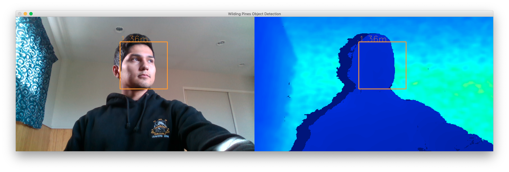

# Face detection demo

This demo shows how OpenCV and the Intel D435 depth camera can be used
to find faces and show the average distance to them from the camera.

## Dependencies

* Numpy v1.18.1
* OpenCV v4.1.0
* pyrealsense2 v2.33.1

**NOTE:** Exe compiled OpenCV and pyrealsense2 from source on my Mac.

## Troubleshooting

If you cannot import the Python module make sure that `PYTHON_PATH`
points to where those libraries were compiled to, and that `PYTHON_PATH`
is set in your `.zshrc` or `.bash_profile` file.

